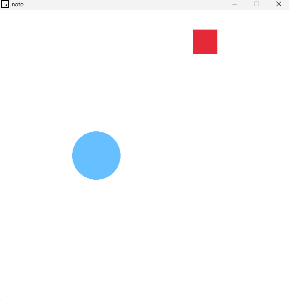
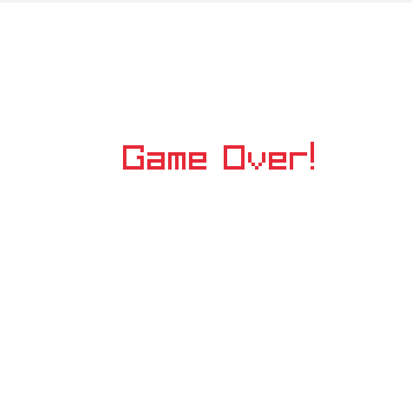

# Axe Game

A simple 2D game built with C++ and the Raylib library. This project marks the beginning of my journey into game development, focusing on understanding the fundamentals of game loops, player input, rendering, and collision detection.




## 📜 Description

The objective of the game is straightforward: control the player (a blue circle) and avoid the moving obstacle (a red axe/square). If the player collides with the axe, the game is over. It's a small but complete game loop that serves as a great exercise for learning core programming concepts in a fun, interactive way.

## 🎮 How to Play

- **Objective**: Dodge the red axe for as long as you can!
- **Controls**:
  - **W** - Move Up
  - **A** - Move Left
  - **S** - Move Down
  - **D** - Move Right
- **Game Over**: The game ends and displays a "Game Over!" message when your circle touches the axe.

## 🛠️ Technical Concepts & Technologies Used

This project, while simple, touches upon several key concepts in C++ and game development.

- **Language**: **C++**

  - **Variables & Data Types**: Use of fundamental types like `int` for coordinates and dimensions, and `bool` for game state flags (like `collision_with_axe`).
  - **Braced Initialization**: Used `{}` for initializing variables to prevent uninitialized values (e.g., `int width{600};`).
  - **Operators**: Logical operators (`&&`, `||`) are used for boundary checks and collision logic.
  - **Conditional Logic**: `if-else` statements control the game flow, switching between the main game logic and the "Game Over" screen.
  - **Game Loop**: A `while (!WindowShouldClose())` loop forms the heart of the game, continuously processing input, updating game state, and rendering frames.

- **Game Development Library**: **Raylib**

  - **Window Management**: `InitWindow()` to create the game window and `WindowShouldClose()` to manage the game loop.
  - **Drawing & Rendering**: Using `BeginDrawing()`, `ClearBackground()`, and `EndDrawing()` to manage the rendering cycle. Shapes are drawn to the screen using `DrawCircle()` and `DrawRectangle()`, and text with `DrawText()`.
  - **Input Handling**: Capturing keyboard input with `IsKeyDown()` to control the player's circle.
  - **Frame Rate Control**: `SetTargetFPS()` is used to ensure the game runs consistently across different hardware.

- **Core Game Mechanics Implemented**
  - **Player Movement**: Updating the circle's `x` and `y` coordinates based on keyboard input.
  - **Enemy AI (Simple)**: The axe moves vertically on its own. Its direction is inverted when it hits the top or bottom edge of the screen, creating a simple patrol behavior.
  - **Collision Detection**: A basic **Axis-Aligned Bounding Box (AABB)** collision check is implemented. It works by checking if the bounding box of the circle and the bounding box of the axe are overlapping on both the X and Y axes. The condition is:
    ```cpp
    bool collision_with_axe =
        (b_axe_y >= u_circle_y) && // Axe's bottom edge is past circle's top edge
        (u_axe_y <= b_circle_y) && // Axe's top edge is before circle's bottom edge
        (r_axe_x >= l_circle_x) && // Axe's right edge is past circle's left edge
        (l_axe_x <= r_circle_x);   // Axe's left edge is before circle's right edge
    ```
  - **Game State Management**: The `collision_with_axe` boolean acts as a simple state machine. When `false`, the game is active. When `true`, the game transitions to the "Game Over" state.

## ⚙️ How to Build and Run

### Prerequisites

You need to have [Raylib](https://www.raylib.com/) installed and configured for your development environment.

### Compilation

You can compile the `axe_game.cpp` file using a C++ compiler like `g++`. The exact command may vary based on your operating system. For example, on Linux:

```bash
g++ axe_game.cpp -o axe_game -lraylib -lGL -lm -lpthread -ldl -lrt -lX11
```

## Running the Game

```bash
./axe_game
```
